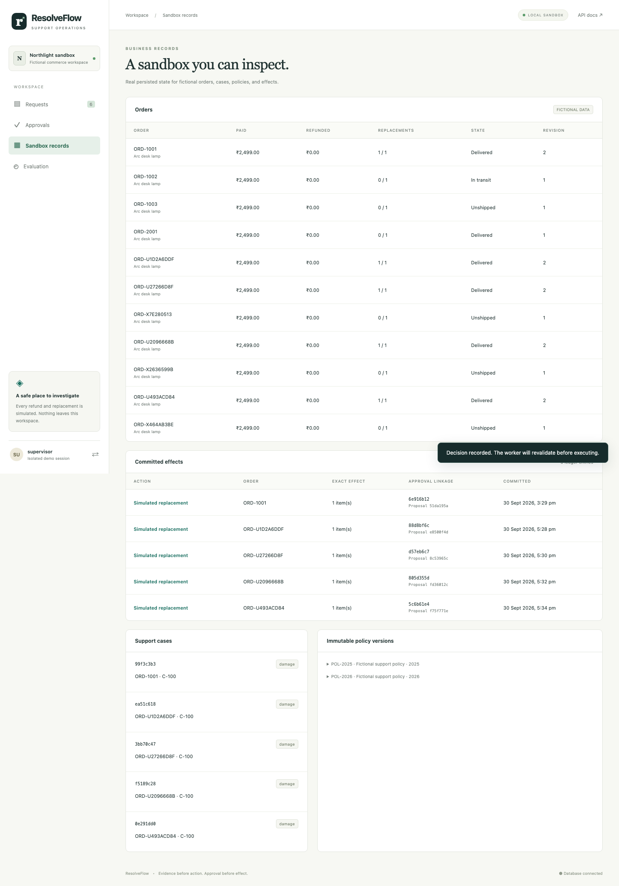

# ResolveFlow

A support operations agent with typed tools, persistent investigations, exact supervisor approvals, and restart-safe **simulated** business actions. Built as an AI engineering portfolio project. Every customer, order, payment, refund and replacement is fictional.

The model can select investigative tools. Deterministic code controls scope, eligibility and writes. The default fixture demonstrates plumbing without credentials; it does **not** demonstrate model reasoning quality.

## Run for free on macOS

Python 3.12, uv and Docker Desktop are required. Apple silicon is supported. On the requested MacBook Air M5 (24 GB / 1 TB), run PostgreSQL and the backend locally; no paid database, vector service, hosted agent platform or cloud worker is required.

```sh
uv sync --frozen
uv run python scripts/bootstrap.py
docker compose up -d --build
```

Open **http://localhost:8090**. Choose Support operator in the isolated demo, submit a request, then switch to Supervisor to approve the exact proposal. Developer sessions expose traces and evaluation. Local demo credentials are randomly generated in `.env` and ignored by Git. The one-click demo is explicitly isolated by loopback port bindings and a fictional workspace. Disable it for any remote deployment.

To run Python services directly while keeping PostgreSQL in Docker:

```sh
docker compose up -d db
uv run python -m resolveflow.cli init
uv run uvicorn resolveflow.api.app:app --host 127.0.0.1 --port 8090
# In another terminal:
uv run python -m resolveflow.jobs.worker
```

Stop with `docker compose down`; the named volume retains the database and checkpoints. **Do not use `down -v` if you want to keep runs.** Initialization is idempotent. A fresh checkout does not need model credentials.

## Try the complete journey

1. As an operator, submit: `My lamp arrived damaged. Please replace it.` Choose **Fixture**.
2. Supply `ORD-1001` when asked. Then supply a damage description, report timestamp `2026-09-10T10:00:00+00:00`, and sandbox photo-review attestation.
3. Inspect order/tracking observations, purchase-date policy `POL-2026`, deterministic eligibility, case and exact proposal. Nothing has been replaced yet.
4. Switch to Supervisor, select the request and approve. Inspect the uniquely linked replacement in Sandbox records. A rejection creates no protected effect.
5. For a shipping-fee refund, submit `My order ORD-1002 is delayed. Refund the shipping fee.` For cancellation, use `Please cancel ORD-1003.` Each eligible effect needs approval.

Seed dates are fictional fixed dates; evaluation uses a frozen clock. The UI uses the real observation clock. Photo review is an operator attestation in this sandbox, not image understanding.



## Execution modes

| Mode | Decisions | Credentials | What it establishes |
|---|---|---|---|
| `baseline` | Inspectable fixed decision rules | None | Shared tools, policy and approval workflow |
| `fixture` | Inspectable scripted adapter | None | Plumbing, UI and recovery only |
| `provider` | Actual OpenAI-compatible model tool calls | Local Ollama or configured free-tier key | Live orchestration, only after a real run is verified |

Live mode is disabled by default and never falls back to a fixture. See [free services and Mac setup](docs/FREE_TIERS.md). Provider request/timeout/repair budgets are bounded; unknown usage stays unknown. No live provider was installed or called during the default verification.

## Verify

```sh
uv run ruff check src tests scripts migrations
uv run ruff format --check src tests scripts migrations
uv run mypy src
uv run pytest -q
uv run python -m resolveflow.evaluation.runner --split ci
uv run python scripts/recovery_demo.py
uv run python scripts/load_demo.py
# Verify the committed version through a local clone and isolated DB schema:
uv run python scripts/clean_checkout.py
# With the API and worker running (uses a separate fresh sandbox order):
uv run playwright install chromium
uv run python scripts/browser_smoke.py
```

Tests and evaluation create random PostgreSQL schemas and drop them at completion; they do not reset your demo workspace. This development DB user needs schema creation permission. Fault injection is CLI-only. Full frozen evaluation:

```sh
uv run python -m resolveflow.evaluation.runner --split development
uv run python -m resolveflow.evaluation.runner --split test
```

100 AI-authored synthetic families are frozen 35 development / 65 test, with 20 templates and five separately seeded orders per template. There is no human review claim. Gold outcomes stay outside agent-visible state. Reports show waiting/rejection outcomes, assertions, fault firing, actual ledger effects, hashes, failures, usage, and explicit denominators. Review sheets remain unfilled. Raw outputs are ignored; intentionally exported fictional evidence is in `docs/evidence`.

See [acceptance evidence](docs/ACCEPTANCE.md), [evaluation limitations](docs/EVALUATION.md), [architecture and transactions](docs/ARCHITECTURE.md), [policy](docs/POLICY.md), [API examples](docs/API.md), [deployment](docs/DEPLOYMENT.md), and [learning guide](docs/LEARNING.md).

The live-provider comparison, remote deployment, and human semantic review have separate **unverified** status. Synthetic fixture/baseline passes are not production accuracy, a security guarantee, or evidence that a model resisted injection.
