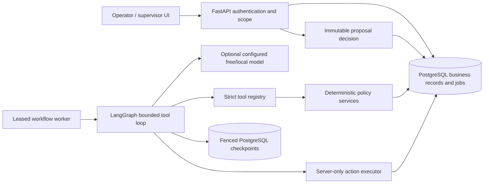
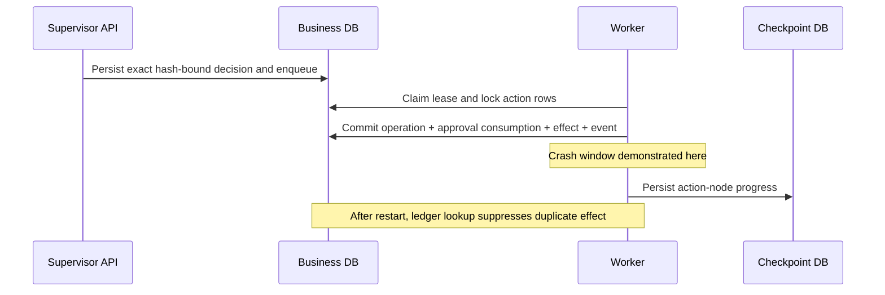

# Architecture, boundaries and failure recovery

One modular Python application, one separate bounded worker process, one PostgreSQL database. No external business service is connected. API sync handlers run in FastAPI's threadpool; the worker makes blocking provider requests outside transactions. One job per worker is processed at a time; additional workers use atomic claims.

## Scope and contracts

Server role configuration assigns the operator C-100; supervisor/developer C-100 and C-200; C-900 belongs to another workspace. UUIDs do not grant access. Worker scope narrows further to the run's one customer. Roles are a small demo account system, not tenancy/enterprise SSO. Supervisor decisions cannot expand this scope.

`get_order`, `get_tracking`, `search_policy`, `check_resolution_eligibility`, `create_case`, `propose_resolution`, `request_clarification` are the complete model registry. No shell, SQL, arbitrary fetch or protected executor is exposed. Strict Pydantic arguments reject unknown fields, incorrect primitive types, unsupported action-specific fields, and bounds violations.

Final outcomes are built from actual persisted state. Structured references and order/policy IDs are checked; semantic wording still needs review. No chain of thought is requested, recorded or displayed. Observations preserve reported statements and operator photo-review attestation separately from order and shipment records.

## State and waits

Queued → running/recovering → awaiting_information or awaiting_approval → queued on authorized new input → running → completed/rejected/escalated/failed. Cancellation can win the run lock before a new business action. Terminal runs cannot be resumed through clarification or approval endpoints. Checkpoint thread ID equals the server-generated run UUID. API services authorize all resume input; no arbitrary graph-update endpoint exists.

A clarification wait and an approval wait use LangGraph `interrupt`. On resume, their containing node restarts. Therefore a wait performs no protected action. The separate action node is idempotent. Each authorized human-input cycle gets a bounded job retry budget; graph call/tool/context/time budgets persist across cycles, so clarification cannot reset an agent loop budget.

Source: [LangGraph persistence](https://docs.langchain.com/oss/python/langgraph/persistence); installed APIs were inspected and used against `uv.lock`.

## Transactions and locks

1. API submission commits run + job + audit event together. Workspace/actor/request-key uniqueness distinguishes transport retries from distinct requests; canonical payload hashes detect conflicting retries.
2. Worker claims one eligible job using `FOR UPDATE SKIP LOCKED`, sets random owner token and real-time lease, then releases the transaction. Heartbeat refreshes ownership while the worker processes one run.
3. Every published application event/state mutation locks run then job and validates current token/lease. Checkpoint writes also take these locks through `FencedSaver`, validating ownership before publishing via the separate PostgreSQL saver transaction. Provider calls happen without either transaction open.
4. Read and case/proposal tools use stable tool-call operation keys plus a unique case/proposal per run. A replay returns the saved observation or persisted case. A different payload under the same key conflicts.
5. Supervisor decision locks the run, then proposal; a unique approval makes approve/reject races have a transactional winner. A repeated same actor/decision/hash/original revision returns the original approval. A changed decision conflicts.
6. Protected executor locks run/job, proposal/approval and order. **The order lock uses `populate_existing=True` to refresh SQLAlchemy's identity map.** It rechecks ownership, approval hash, expiry, source policy integrity, relevant order revision, facts, amount, currency and deterministic eligibility. Operation ledger, approval consumption, order update, effect and audit event commit in one transaction.
7. Graph checkpoints are separate transactions. A committed action can precede the graph checkpoint. Retry consults `action:{proposal_id}` and returns the existing effect. The test kills an actual worker at this boundary and starts a different process after the lease truly expires.

These are unique committed effects in one sandbox DB under repeated delivery. This is not general distributed exactly-once execution. Read failures have bounded repair; provider transient HTTP/network failures have bounded backoff. Validation/authorization/policy rejection is not transient. A worker technical exception records a protected failure; developer retry is limited to eligible transient failures and remaining attempts. Exhausted budgets produce escalation/failure and disclose earlier committed effects.

Cancellation locks the same run/job as execution. If cancellation wins, further writes fail the fence. If a business commit wins first, its effect stays visible. Lease time uses the real clock; policy/evaluation time uses the controlled run clock.

## Retention and limitations

`uv run python -m resolveflow.observability.retention` redacts terminal conversations older than RETENTION_DAYS and deletes corresponding checkpoint threads. It retains immutable proposal/approval/ledger audit metadata. Application redaction and checkpoint deletion are separate transactions: rerun after interruption to finish privacy cleanup. It does not erase backups, evaluation exports or the intentionally published fictional evidence. Pending runs are never purged.

One item line and one shipment/payment per order keep the domain manageable. Operator evidence is structured and manually attested; attachment inspection and multi-item partial replacement are outside scope. Observability is persisted structured events plus a protected metrics endpoint, not an external telemetry subscription. Polling reflects actual state; there is no fabricated progress stream.
