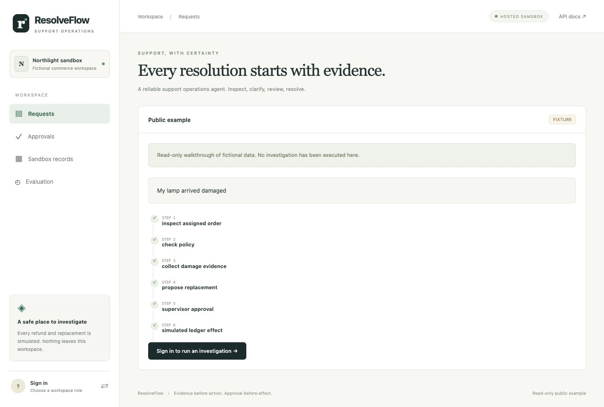

# Deployment and free-cost boundary

## Cloud deployment: Render Free + Neon Free

The cloud target is a single **Free** Render Python web service backed by a separately provisioned **Free Plan** Neon PostgreSQL project. [`render.yaml`](../render.yaml) selects the free plan explicitly. It does not create a paid worker, disk or Render database. `resolveflow.hosted` initializes the schema, then supervises the API and a separate worker process. An unexpected child exit stops the other child and fails the host so the platform can restart it. SIGTERM stops new work and allows up to 125 seconds for the children to exit. The Blueprint requests a 130-second platform shutdown delay; the directly created service uses Render’s default shutdown window because this field is not exposed by the creation tool or service settings UI. The app’s longer grace period does not override a platform hard stop. Hard stops still use the persistent queue, leases, checkpoints and operation ledger to recover.

As of 30 September 2026, Render's free web service sleeps after 15 minutes without inbound traffic and can take about a minute to wake. Its filesystem is ephemeral and its free PostgreSQL expires after 30 days; those are the reasons the deployment uses external Neon storage. The API and worker pause together while Render sleeps. A browser request wakes the service and queued work resumes after applicable leases expire. This is a portfolio deployment with sleep and quota limits, not an always-on service. See [Render Free](https://render.com/docs/free).

Neon's Free Plan currently includes 100 CU-hours and 0.5 GB of database storage per project. Keep the project on Free, use one primary compute with scale-to-zero, and place it near Render's region. Select a direct PostgreSQL connection string with TLS (the selected project is in AWS US East 2, matching Render Ohio). Worker polling keeps the compute active while the web service is awake; it is configured to five seconds to reduce database traffic. The worker is not a mechanism to avoid provider sleep or quotas. Monitor actual database compute/storage usage and host bandwidth/build usage. See [Neon's Free Plan](https://neon.com/blog/building-patterns-unlocked-by-scale-to-zero). Do not add a paid plan or payment method for this deployment; Render can charge overages on an account that has a payment method.

Deployment steps:

1. Connect Render and Neon through their integrations, using free accounts. Inspect existing resources and billing before creating anything; reuse a matching ResolveFlow project rather than creating duplicates.
2. Create the isolated Neon project/database, then obtain its **direct** connection URI with `sslmode=require` (or a stronger verification mode). Store it directly in Render's secret environment variable `DATABASE_URL`. Standard `postgres://` and `postgresql://` URIs are normalized to the installed psycopg driver. Never paste a connection URI into public GitHub files, issue comments, or browser URLs.
3. Create the Render Blueprint from `https://github.com/cyash24f3/resolveflow`, or create an equivalent Python **web service** with compute plan **Free**, Python 3.12.13, the Blueprint's environment values, build command `pip install uv==0.10.4 && uv sync --frozen --no-dev`, and start command `.venv/bin/python -m resolveflow.hosted`. Match the database region. Use health check `/api/v1/ready` and shutdown delay 130 seconds.
4. Generate four independent secrets for `SESSION_SECRET`, `OPERATOR_PASSWORD`, `SUPERVISOR_PASSWORD`, and `DEVELOPER_PASSWORD` (the Blueprint generates them). Keep `REMOTE_DEPLOYMENT=true`, `DEMO_MODE=false`, `COOKIE_SECURE=true`, and `PROVIDER_ENABLED=false` initially. Startup rejects weak/shared secrets, insecure cookies, local demo access, or a database without TLS.
5. Await successful build/deploy and record the platform-provided HTTPS URL. Verify readiness, the public read-only example, denied anonymous writes, credential login, operator scope, clarification, supervisor approval/rejection, and actual committed ledger state. Verify a restart against the same database. Only then mark remote deployment verified and add the actual URL to README and GitHub's About field.

An operator can sign in with the configured role password; share it privately with intended reviewers. Supervisor and developer passwords must remain private. The public example is a clearly labeled illustrative walkthrough; it neither creates a run nor displays private investigations. Optional live inference requires a separately supplied Groq Free Plan key stored as a host secret. It is disabled until verified, with no fixture fallback.

Cloud status: **public HTTPS deployed, workflow verified, and redeploy persistence verified**. The actual service is [ResolveFlow](https://resolveflow-wojr.onrender.com), service `srv-daugnmjncjis73fisc90`, in the confirmed `cyash` workspace. Its compute plan is `free`, region `ohio`, and health check `/api/v1/ready`. The source is a public Git URL; this account has no connected GitHub provider. Auto-deploy is explicitly off. The owner deploys a checked `main` commit through Render’s Manual Deploy action or the authenticated connector. The Blueprint’s `checksPass` setting applies when the Git provider is connected; setting the flag alone did not establish a working trigger. See [Render deploys](https://render.com/docs/deploys). Neon project `bold-cake-51114732`, primary branch `br-shiny-tooth-b5pn8liz`, is on Free; its direct compute is capped at 0.25 CU. Provider-controlled free suspension was left unchanged. No paid worker, disk or database was created.

[`evidence/cloud-deployment.json`](evidence/cloud-deployment.json) records actual HTTPS login for all roles, secure session cookies, public read-only example, blocked anonymous writes, CSRF and customer scope, missing-fact clarification, denied operator approval, denied stale payload hash, idempotent approval with exactly one committed simulated effect, and rejection with zero effects. The first check submitted extra clarification fields and was rejected; `scripts/cloud_smoke.py` now follows the requested facts in separate steps and resumed the same runs. A real Render process replacement from deploy `dep-daugo6me0cbs73dhlqa0` to `dep-daumvbfpn0mc738ao1k0` preserved both investigations and the exact committed effect. This is deployment evidence for the baseline workflow, not live model quality.



Role passwords and database credentials are in the host’s secret environment. A private, ignored `outputs/cloud-credentials.env` file with mode 0600 holds the owner’s copy; never commit or publish it. Share only the intended role password privately. The public repository and walkthrough contain no login credentials.

To repeat non-mutating persistence verification after a platform redeploy, use the owner’s private credentials:

```sh
uv run python scripts/cloud_smoke.py --url https://resolveflow-wojr.onrender.com --phase persistence
```

The `journey` phase creates fictional runs and changes a seeded sandbox order, so run it once on a fresh deployment or resume only its own partially completed verification. It is not a production probe or automatic keep-alive.

## Local containers

The tested path is local Docker Compose on Apple silicon, binding API and DB ports to loopback. API, worker and PostgreSQL run separately; migrations and checkpoint setup run once through the `migrate` service. A named `pgdata` volume persists all records/checkpoints. The image runs as UID 10001 and contains no `.env`, credentials, screenshots or local outputs.

```sh
uv run python scripts/bootstrap.py
docker compose up -d --build
curl http://localhost:8090/api/v1/ready
docker compose ps
docker compose restart worker
# Preserves the named volume:
docker compose down
docker compose up -d
```

For a remote environment you control, reuse the same image and database-backed queue. Supply secrets using the platform's secret store, run the documented migration job, keep a persistent PostgreSQL volume or configured managed PostgreSQL connection, and run one always-available worker initially. Disable demo access (`DEMO_MODE=false`), set unique role passwords, a random SESSION_SECRET, `COOKIE_SECURE=true`, and use HTTPS through a trusted reverse proxy. Publish only the API through that proxy; do not expose PostgreSQL. The proxy must set the correct source IP and host; never use the local-demo Host-header check as a remote security perimeter.

The Render/Neon deployment above verifies remote accounts, HTTPS, credential roles and supervised worker execution. Local named-volume persistence and cloud PostgreSQL persistence have separate evidence. No always-on free cloud worker is promised. Avoid a sleeping free web process for durable worker claims; the DB survives sleep but investigations will wait. The requested cloud path is Render Free with Neon Free; the local stack remains available for development.

Validate readiness, credential login, operator scope, CSRF failures, supervisor decision, persisted effect, actual worker restart, read-only public mode, and DB volume survival before making a remote service available. `PUBLIC_READ_ONLY=true` blocks authenticated mutation routes; `/api/v1/sample` is a separate static fictional example, not a public private-run endpoint. Remove or gate `/docs` at the reverse proxy if desired; it contains schemas, not credentials.

Graceful termination stops new claims and lets the current bounded provider attempt finish. Compose’s stop grace period is 130 seconds; hard termination is reconciled after lease expiry. Back up the PostgreSQL volume using standard PostgreSQL tools. Keep backups private and apply your own backup retention, as the conversation-redaction CLI only covers the active database and checkpoints.
